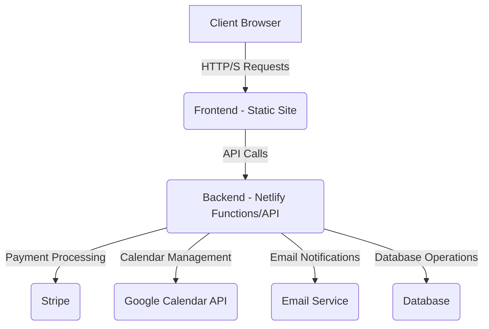

# E-commerce Website Specification: Stureby Photography

## 1. Introduction

This document outlines the functional and technical specifications for the Stureby Photography e-commerce website. The platform will serve as a central hub for customers to purchase photographs, pre-order photography magazines, book photography sessions, and for aspiring photographers to apply as associates.

## 2. Key Features

*   **Photography E-commerce:** Browse, select, and purchase digital or physical photographs.
*   **Photography Magazine Pre-order:** Pre-order upcoming photography magazines.
*   **Photography Session Booking:** Book various photography sessions (corporate, product, fashion) with calendar integration.
*   **Photography Associate Application:** Apply to become a photography associate through an online form.
*   **Secure Payment Processing:** Integration with Stripe for all transactions.
*   **Responsive Design:** Optimized for various devices (desktop, tablet, mobile).

## 3. User Roles

*   **Customer:** Can browse products, pre-order magazines, book sessions, and apply as an associate.
*   **Administrator:** Manages products, orders, bookings, and associate applications (backend functionality, not detailed in this frontend spec).

## 4. Technical Architecture (High-Level)

The website will follow a client-server architecture. The frontend will be a static site, and the backend will handle API requests, payment processing, calendar integration, and email notifications.

## 5. Detailed Feature Breakdown

### 5.1. Photography E-commerce

*   **Product Display:**
    *   Display photographs with high-resolution images, titles, descriptions, categories, and prices.
    *   Filtering and sorting options by category.
*   **Shopping Cart (if applicable):**
    *   Ability to add multiple photographs to a cart.
    *   View cart contents, update quantities, and remove items.
*   **Checkout Process:**
    *   Secure checkout flow.
    *   Integration with Stripe for credit card payments.
    *   Order confirmation and digital delivery/shipping information.

### 5.2. Photography Magazine Pre-order

*   **Magazine Display:**
    *   Showcase upcoming magazines with cover art, descriptions, release dates, and pre-order prices.
*   **Pre-order Process:**
    *   Customers can select a magazine and proceed to pre-order.
    *   Payment handled via Stripe.
    *   Confirmation of pre-order.

### 5.3. Photography Sessions Booking

*   **Session Types:**
    *   Clearly define different session types (e.g., Corporate, Product, Fashion) with descriptions, durations, and pricing.
*   **Calendar Integration:**
    *   Display available booking slots from the Google Calendar associated with `novtec.x.ab@gmail.com`.
    *   Customers select a preferred date and duration.
    *   Real-time availability check.
*   **Booking Process:**
    *   Customers provide name, email, and service type.
    *   Upon slot selection, a booking request is sent to the backend.
    *   Backend creates a calendar event in `novtec.x.ab@gmail.com`'s Google Calendar.
    *   Payment for the session is processed via Stripe.
    *   Booking confirmation sent to the customer via email.

### 5.4. Photography Associate Application

*   **Application Form:**
    *   A dedicated form for aspiring photography associates.
    *   Fields: Name, Email, Phone, Portfolio URL, Experience, Gear, Message.
*   **Submission:**
    *   Form submission sends an email to `novtec.x.ab@gmail.com` with the applicant's details.
    *   Confirmation message displayed to the applicant.

## 6. Integration Points

*   **Stripe:** For all payment processing (e-commerce, magazine pre-orders, session bookings).
*   **Google Calendar API:** For managing and displaying available photography session slots for `novtec.x.ab@gmail.com`.
*   **Email Service:** For sending booking confirmations, pre-order confirmations, and associate application notifications to `novtec.x.ab@gmail.com` and customers.

## 7. Future Considerations

*   User accounts for managing orders and bookings.
*   Admin panel for content and order management.
*   Advanced filtering and search for photographs.